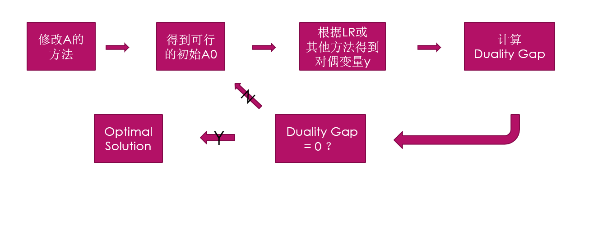

#### Summary
- **primal**
\[
max \quad  c^T x \\
\mbox{s.t.}  \quad  Ax \leq b \\
      x \geq 0
\]

- **dual**

\[
min \quad  b^T y \\
\mathrm{s.t.} \quad  A^T y \geq c \\
      y \geq 0
\]

- [x] _传统 Inverse_: 给定 x0. 很显然 x0 需要在边界上.

此时$c_0$未知
$$\begin{align}
min \quad & \|c_0 - c\|_1 \nonumber  \\
s.t. \quad & Ax_0 \leq b \\
      &   b^T y = c_0^T x_0 \nonumber \\
      &   A^T y \geq c_0   \nonumber
\end{align}$$

- [x] **现在的 Inverse**:

- 现在给定内部可行 $x_0$ 都可以.因为 A 维度更大使得可更改的范围更大.

- 找到使得 $x_0$ 是原问题的最优解的最小改变量

$$
\begin{align}
min \quad & \|A_0 - A\|_1     \\
s.t. \quad & A_0x_0   \leq b  \\
        &   A0^T y \geq c     \\
        &   b^T y - c^T x_0 = 0.
\end{align}$$

1. Notice that the constraint(3) satisfies primal feasibility when $x=x_0$

2. The constraint(4) is bilinear/dual feasibility

3. $b^T y - c^T x_0 =$ duality gap and when y is optimal this gap is 0.

- 这里注意区分 x0 是最优的 和 x 一般时的表达形式区别

- [x] **基本分析**：
>  - 当 $A_0x_0 =b$ this is active   则对应的 $y_i \geq 0$.
>  - 当 $A_0x_0 >b$ this is inactive 则对应的 $y_i = 0$
> - 而对于不含松弛变量的 n 维 x0 必是至少 n 个 constraint 的交点。

- [x] 一范数下，这就是一个含有 bilinear constraint 的线性规划问题。由于 bilinear 无法保证存在最优解，因而存在几种特殊条件下分类得到最优解的方法。

--------

- [x] 结合修改规则，每一条 constraint 要过给定点x0只需要修改x0中系数最大对应的 A_i 分量即可。

- [ ] 接下来是如何确定要准确修改哪些 constraints 的问题

--------

#### 现在考虑如何结合 拉格朗日松弛算法 解决

1. 一种方法是根据修改 A 的方法，(即计算 b- Ax0 给定点到 constraint 的距离)
2. 根据该改法给定一个可行的初始 A0 ，即这时根据该修改方法已经知道哪些constraints 是 active 的。
3. 对应的 y 值大于等于零.剩下inactive 对应的 y 值为0.
4. 由于 y 与 constraint 一一对应.根据次梯度法或是别的方法计算此时对应的对偶变量 y 即可(利用对偶问题计算即可).
- 所以只要 constraints 找的对,就能得到正确的解。
5. 计算 $b^T y - c^T x_0$  **duality gap** 是否为 0 如果不为0，则这时需要换一组 A0 修改.再重复该过程。

- 很显然这一过程的复杂度较大，但这样做一定可以找到最优解。是一个精确的算法。

流程图

- [ ] 关于如何在 Lagrangian relaxation 内使用没想法

$Z(\mu^k)$ 为加上拉格朗日乘数之后的问题最优解
在最大化问题中是上界。

$$t_k = \frac{\lambda_k(Z(\mu^k)-Z^*)}{\|b-A^kx_0\|^2}$$
更新规则
$$ \mu^{k+1} = \mu ^k + t_k(b-A^kx_0)$$

尝试将A的改变量加入到更新过程中，惩罚量放进去 在原问题中

--------

因为要从 A 到 \lambda

算法中无非是迭代点不断靠近最优点的过程，探究这个过程也是我们加速求解修正算法的关键，比如一般的内点法，中心路径法。

一种方法是具有强对偶性的最优化在最优点时duality gap一定为0 可以在迭代时不断减少这个duality gap以达到优化目的。

内点时，约束条件没有意义
